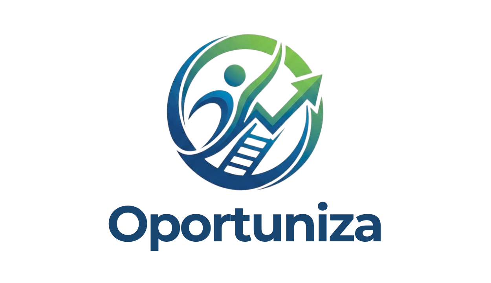

<div align="center">
  

# Oportuniza

**Marketplace de serviços operacionais e domésticos**

Plataforma que conecta profissionais autônomos a pessoas que precisam contratar serviços de maneira rápida, segura e confiável.

</div>

## Sobre o projeto

O Oportuniza é um sistema desenvolvido como Trabalho de Conclusão de Curso (TCC). Seu objetivo é reduzir a informalidade na contratação de serviços essenciais, oferecendo visibilidade aos profissionais e mais segurança aos contratantes.

A plataforma está sendo preparada para oferecer:

- cadastro de contratantes e prestadores;
- perfis profissionais com especialidades e portfólio;
- pesquisa de profissionais por categoria e localização;
- solicitações e acompanhamento de serviços;
- avaliações bilaterais após a conclusão do serviço;
- reputação baseada em avaliações verificadas;
- favoritos e contato com profissionais;
- proteção dos dados pessoais e do endereço dos usuários.

## Estado atual

O desenvolvimento está sendo realizado uma tela por vez. Atualmente, o projeto contém a Landing Page institucional do Oportuniza, composta por:

- Navbar responsiva;
- seção principal de apresentação;
- benefícios para profissionais e contratantes;
- seção de segurança e confiança;
- explicação do funcionamento em três passos;
- Footer institucional responsivo.

Neste momento, apenas a rota `/` está ativa. As telas de autenticação, pesquisa, perfil e painel serão adicionadas nas próximas etapas.

## Tecnologias

- [React](https://react.dev/)
- [TypeScript](https://www.typescriptlang.org/)
- [Vite](https://vite.dev/)
- [Tailwind CSS](https://tailwindcss.com/)
- [Supabase](https://supabase.com/)
- [React Router](https://reactrouter.com/)
- [Lucide React](https://lucide.dev/)
- Montserrat como tipografia institucional

## Requisitos

Antes de iniciar, instale:

- Node.js 18 ou superior;
- npm;
- Git.

## Executando localmente

Clone o repositório e acesse sua pasta:

```bash
git clone <URL_DO_REPOSITORIO>
cd Oportuniza.TCC
```

Instale as dependências:

```bash
npm install
```

Inicie o ambiente de desenvolvimento:

```bash
npm run dev
```

O site estará disponível em:

```text
http://localhost:3000
```

## Configuração do Supabase

Crie um arquivo `.env.local` na raiz do projeto:

```env
VITE_SUPABASE_URL=https://SEU-PROJETO.supabase.co
VITE_SUPABASE_PUBLISHABLE_KEY=SUA_CHAVE_PUBLICA
```

Use somente a chave pública ou `publishable` no frontend. Nunca coloque a chave `service_role` ou outra chave secreta no React, pois ela ignora as políticas de segurança do banco.

Depois, abra o SQL Editor do Supabase e execute o conteúdo de:

```text
supabase/schema.sql
```

Esse arquivo cria a estrutura inicial do banco, incluindo perfis, categorias, serviços, portfólios, solicitações, avaliações, respostas e favoritos.

### Cliente do Supabase

O arquivo `supabase/supabase.ts` possui três responsabilidades:

1. ler a URL e a chave pública das variáveis de ambiente;
2. criar e exportar o cliente usado para consultar o Supabase;
3. disponibilizar uma função que testa a conexão e verifica a tabela `profiles`.

Exemplo de uso:

```ts
import { supabase } from "../supabase/supabase";

const { data, error } = await supabase.from("profiles").select("*");
```

Os valores de fallback presentes nesse arquivo apenas evitam que a aplicação quebre antes da configuração. Eles não representam uma conexão válida.

## Scripts disponíveis

| Comando           | Descrição                                     |
| ----------------- | --------------------------------------------- |
| `npm run dev`     | Inicia o projeto em modo de desenvolvimento   |
| `npm run lint`    | Valida os tipos TypeScript sem gerar arquivos |
| `npm run build`   | Gera a versão de produção na pasta `dist`     |
| `npm run preview` | Executa localmente a versão de produção       |

## Estrutura principal

```text
Oportuniza.TCC/
├── public/
│   └── assets/               # Logos e imagens institucionais
├── src/
│   ├── components/           # Componentes compartilhados
│   │   └── HomePage/         # Seções exclusivas da Landing Page
│   ├── lib/                  # Tipos e dados auxiliares
│   ├── pages/                # Páginas ligadas às rotas
│   ├── services/             # Serviços e regras de acesso a dados
│   ├── App.tsx               # Configuração das rotas
│   ├── index.css             # Estilos globais e identidade visual
│   └── main.tsx              # Ponto de entrada da aplicação
├── supabase/
│   ├── schema.sql            # Estrutura e segurança do banco
│   └── supabase.ts           # Cliente e teste de conexão
├── package.json
└── README.md
```

## Identidade visual

O projeto utiliza a fonte Montserrat e as cores institucionais:

| Nome               | Cor       |
| ------------------ | --------- |
| Azul Profundeza    | `#1E4F7A` |
| Verde Broto        | `#4DA25A` |
| Verde Herbal       | `#9ACE5F` |
| Fundo              | `#F4F7F9` |
| Títulos            | `#184671` |
| Textos secundários | `#5F6B75` |
| Corpo              | `#141414` |

## Segurança

- Variáveis `.env*` não devem ser enviadas ao repositório.
- Chaves secretas do Supabase nunca devem ser usadas no frontend.
- As tabelas devem permanecer com Row Level Security habilitado.
- O endereço completo de um prestador não deve ser exibido publicamente.
- Avaliações devem ser liberadas somente após a conclusão do serviço.

## Autores

Projeto acadêmico Oportuniza — 2026.
